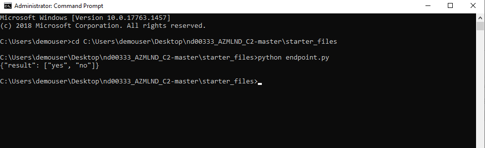
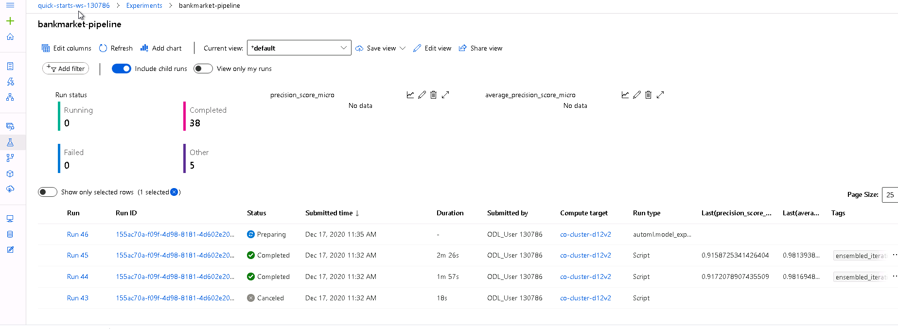

# Cloud Based Machine Learning Production Model and Pipeline on Azure

In this project, we are using the Bank Marketing dataset to create a cloud-based machine learning production model and a pipeline on Azure Machine Learning. We will create a model with Auto Machine Learning, deploy it, and consume it. We also will  create, publish, and consume a pipeline. We will describe our work in this README file and in a screencast video.

 


[TOC]

## Key Steps

### Step 1: Authentication

In general, there three authentication workflow that you can use when connecting to the workspace:

- **Interactive**: You use your account in Azure Active Directory to either directly authenticate, or to get a token that is used for authentication. Interactive authentication is used during *experimentation and iterative development*. Interactive authentication enables you to control access to resources (such as a web service) on a per-user basis.
- **Service principal**: You create a service principal account in Azure Active Directory, and use it to authenticate or get a token. A service principal is used when you need an *automated process to authenticate* to the service without requiring user interaction. For example, a continuous integration and deployment script that trains and tests a model every time the training code changes.
- **Managed identity**: When using the Azure Machine Learning SDK *on an Azure Virtual Machine*, you can use a managed identity for Azure. This workflow allows the VM to connect to the workspace using the managed identity, without storing credentials in Python code or prompting the user to authenticate. Azure Machine Learning compute clusters can also be configured to use a managed identity to access the workspace when *training models*.

see [Set up authentication - Azure Machine Learning | Microsoft Docs](https://docs.microsoft.com/en-us/azure/machine-learning/how-to-setup-authentication) for more information.

#### How To Get Service Principal Client ID

Prerequisites:

- AZ CLI Must be Installed (see [Install the Azure CLI for Windows | Microsoft Docs](https://docs.microsoft.com/en-us/cli/azure/install-azure-cli-windows?tabs=azure-cli))
- The `azure-cli-ml` extension is added or already installed.

##### Get Service Principal Client ID

1. Login to Azure with an account with "subscription Administrator" privileges`AZ Login`

   

2. Create Service Principal `az ad sp create-for-rbac --sdk-auth --name <USERNAME>`

   

3. Take note of th the `"objectId"` in the `clientId`field. 


### Step 2: Automated ML Experiment

In this step we registered a dataset, configure a compute cluster and created an experiment using **Automated ML**

<u>Bank Market Dataset Registered</u> 


After the experiment run finished, a summary of all the models and their metrics are shown. The *Best Model* is shown in the *Details* tab. From here the "best model" can be easily selected and analyzed and deployed.


### Step 3: Deploy the Best Model

Deploying the *best model* will allow to interact with the HTTP API service and interact with the model by sending data over POST requests. To deploy open the model and then click "*deploy*" link in the toolbar. 


### Step 4: Enable Application Insights Logging

Now that the *Best Model* is deployed, its possible to enable *Application Insights* and retrieve logs from the web service. Although this is configurable at deploy time with a check-box, it is useful to be able to run code that will enable/disable it. In this step we demonstrate how to enable *Application Insights* and how to retrieve logs running [logs.py](logs.py) python script.

```python
service = Webservice(name=name, workspace=ws)
logs = service.get_logs()
service.update(enable_app_insights=True)

for line in logs.split('\n'):
    print(line)
```

Logs are shown immediately and the detail panel shows "Application Insights Enabled" = true


Now we can get get the logs with `log.py` 


### Step 5: Consume model endpoints

#### Endpoint Exploration with Swagger

Azure provides a [Swagger JSON file](https://swagger.io/) for deployed models. Head to the *Endpoints* section, and find your deployed model there, it should be the first one on the list.

The easyest way to run swagger locally is from the official docker image. The `swagger.sh` script will download the latest Swagger container, and it will run it on port 9000. 

```
docker pull swaggerapi/swagger-ui
docker run -p 9000:8080 swaggerapi/swagger-ui
```


This script [serve.py](serve.py) creates an HTTP server to expose the current working directory. It is meant to be an easy way to expose a local swagger.json file so that a swagger-ui service can pick it up from localhost:8000

```python
class CORSRequestHandler(SimpleHTTPRequestHandler):
    """
    Allows a simple HTTP server to have CORS enabled by default
    """

    def end_headers(self):
        self.send_header("Access-Control-Allow-Origin", "*")
        SimpleHTTPRequestHandler.end_headers(self)


if __name__ == "__main__":
    if len(sys.argv) > 1:
        # Allows the port to be passed in as an argument
        port = sys.argv[-1]
    else:
        port = 8000

    test(CORSRequestHandler, HTTPServer, port=port)
```

Now Swagger can be used to explore and consume the swagger.json file from Azure endpoint


Log from endpoint during exploration with Swagger


#### Consume Model Endpoints from a client Application

Once the model is deployed,  The [endpoint.py](endpoint.py) script is used to demonstrate an interaction with the trained model. In the script the `scoring_uri` and the `key`must match the key for your service and the URI that was generated after deployment and that are visible in the "Details Tab"



### Step 6: Create, Publish and Consume a Pipeline

For this part of the project, the [aml-pipelines-with-automated-machine-learning-step.ipynb](aml-pipelines-with-automated-machine-learning-step.ipynb) Jupyter Notebook has been used to create, publish and consume a pipeline.


Run Details


Experiment Run




## Screen Recording

https://youtu.be/oxwCxRj6LRA

## Future improvements

### Feature Engeneering

There are some numerical columns in the dataset with a elevated number o distinc values. The values shoud be grouped in bins and colums should be converted to categorical

Less relevant features shoud be removed to simplify the model. PCA shoud be tested to try to reduce model dimension without perfomance loss

The most relevant feature for the prediction *duration*. This information is available when the last call to the prospect customer is concluded. A different model for early prediction,  shoud be developed.

Feature engineering steps in AutoML can be configured passing a specifi *FeaturizationConfig*" in `featurization` parameter in *AutoML Config*.

### Improve Auto ML Configuration

The AutoML experiment has been performend under strict constrains due to lab timeout limit. Increse *experiment timeout* may allow AtuoML to find a better model.

Enable *deep learning* in classification task to see if more advanced model can bring better performance.

### Unbalanced Dataset

The dataset unbalanced. Only about 10% of the customer subscribed. Therefore this issue should be considered to fix for future improvements.


 AutoML is configured to use *AUC_weighted* as primary metric. This is a common "first choice" for unbalanced dataset. AutoML calculates many [different metrics for classification models]( https://docs.microsoft.com/en-us/azure/machine-learning/how-to-understand-automated-ml#classification-metrics). Other *weighted*  metrics such as *matthews_correlation* should be tested.  

An other way to deal with unbalanced dataset is using resampling methods to balance the dataset. The following tecniques should be tested to try to improve model performance:

- undersampling from the majority class in order to keep only a part of these points
- oversampling (replicating some points) from the minority class in order to increase its cardinality
- generating synthetic data consists from the minority class (using SMOTE method for example) to increase its cardinality

